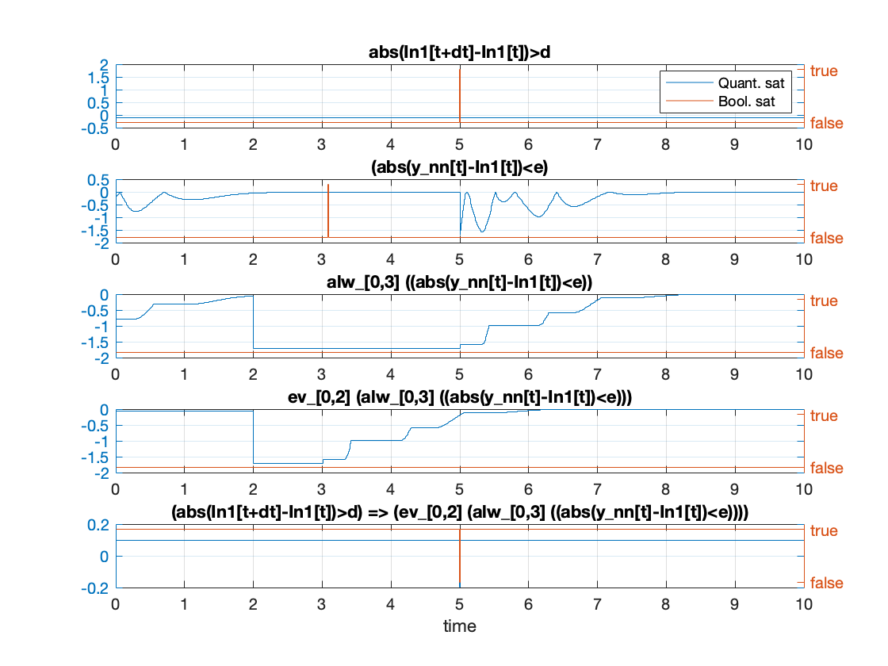
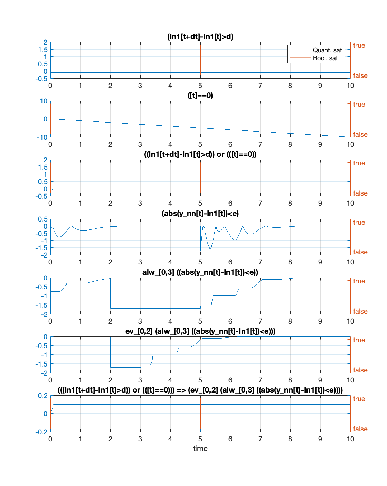
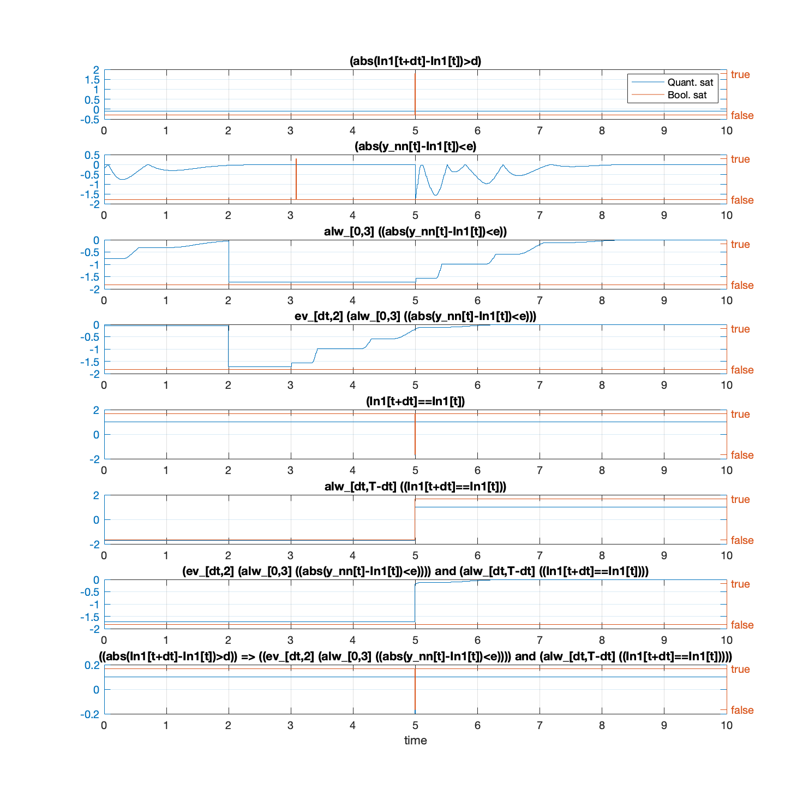

Results to be discussed
===

Test1
---
> Simulation skipped for invalid inputs (they should not).
 
The property is `phi:= In1[t]>0`. The input ranges is defined ` 8<=In1[t]<=12`.

```
++++++++++++++++++++++++++++++++++++++++++++
Running 25 random samples with seed 100
#calls (max:   10)        time spent (max: Inf)     [current  obj]     (current best) 
         1                        0.2               [+1.01736e+01]     (+1.01736e+01)
         2                        0.3               [+9.11348e+00]     (+9.11348e+00)
         3                        0.3               [+9.69807e+00]     (+9.11348e+00)
         4                        0.4               [+1.13791e+01]     (+9.11348e+00)
         5                        0.5               [+8.01888e+00]     (+8.01888e+00)
         6                        0.5               [+8.48628e+00]     (+8.01888e+00)
         7                        0.6               [+1.06830e+01]     (+8.01888e+00)
         8                        0.7               [+1.13034e+01]     (+8.01888e+00)
         9                        0.7               [+8.54683e+00]     (+8.01888e+00)
        10                        0.8               [+1.03004e+01]     (+8.01888e+00)

 Stopped after max_obj_eval was reached (maximum number of objective function evaluations).
No falsifying trace found.

 ---- Best value 8.01888 found with
        In1_u0 = 8.01888
        In1_dt0 = 5
        In1_u1 = 9.41918

Note:  10 simulations skipped for invalid inputs.
```
```
Output argument "BrOut" (and maybe others) not assigned during call to
"BreachProblem/ExportBrSet".

Error in BreachProblem/GetBrSet_Logged (line 879)
            [BrOut, Berr, BbadU] = this.ExportBrSet(BrOut);
            

Error in BreachProblem/GetLog (line 904)
                Rlog = this.GetBrSet_Logged(varargin{:});

Error in STL_stabilization_property (line 112)
Rlog = falsif_pb.GetLog();
```


Test2
---

> Simulation skipped for invalid inputs (probably, they should).
 
The property is `phi:= In1[t]>10`. The input ranges is defined ` 8<=In1[t]<=12`.

```
++++++++++++++++++++++++++++++++++++++++++++
Running 25 random samples with seed 100
#calls (max:   10)        time spent (max: Inf)     [current  obj]     (current best) 
         1                        0.1               [+1.73620e-01]     (+1.73620e-01)
         2                        0.2               [-8.86522e-01]     (-8.86522e-01)
         3                        0.3               [-3.01930e-01]     (-8.86522e-01)
         4                        0.3               [+1.37910e+00]     (-8.86522e-01)
         5                        0.4               [-1.98112e+00]     (-1.98112e+00)
         6                        0.5               [-1.51372e+00]     (-1.98112e+00)
         7                        0.5               [+6.82996e-01]     (-1.98112e+00)
         8                        0.6               [+1.30341e+00]     (-1.98112e+00)
         9                        0.7               [-1.45317e+00]     (-1.98112e+00)
        10                        0.7               [+3.00373e-01]     (-1.98112e+00)

 Stopped after max_obj_eval was reached (maximum number of objective function evaluations).
Falsified with obj = -1.98112

 ---- Best value -1.98112 found with
        In1_u0 = 8.01888
        In1_dt0 = 5
        In1_u1 = 9.41918

Note:  10 simulations skipped for invalid inputs.
```
```
Output argument "BrOut" (and maybe others) not assigned during call to
"BreachProblem/ExportBrSet".

Error in BreachProblem/GetBrSet_Logged (line 879)
            [BrOut, Berr, BbadU] = this.ExportBrSet(BrOut);

Error in BreachProblem/GetLog (line 904)
                Rlog = this.GetBrSet_Logged(varargin{:});

Error in STL_stabilization_property (line 112)
Rlog = falsif_pb.GetLog();
```

Test 3
---
> Earlier, test 3.1. was producing different results with the two different definitions.

*Test 3.1.* Both definitions have the same outputs.

```
pred_1:=In1[t]>10
pred_2:=y[t]>10
phi:= (pred_1) =>  (pred_2) 
```

```
phi:=(In1[t]>10)=> (y[t]>10) 
```

*Test 3.2.* Both definitions have the same outputs.


```
pred_1:=In1[t]>10
pred_2:=y[t]>10
phi:= (pred_1) => ev alw (pred_2) 
```

```
phi:=(In1[t]>10)=> ev alw (y[t]>10) 
```

Test 4
---
>Misses first input change.

`phi:=abs(In1[t+dt]-In1[t])>d => ev_[0,2] alw_[0,3] (abs(y_nn[t]-In1[t])<e) `



> Captures first input change

`phi:= (abs(In1[t+dt]-In1[t])>d or ([t]==0)) => ev_[0,2] alw_[0,3] (abs(y_nn[t]-In1[t])<e) `


> Adding condition on the input to remain constant

`phi:=(abs(In1[t+dt]-In1[t])>d) => ev_[dt,2] alw_[0,3] (abs(y_nn[t]-In1[t])<e) and (alw_[dt,T-dt](In1[t+dt]==In1[t]))`


